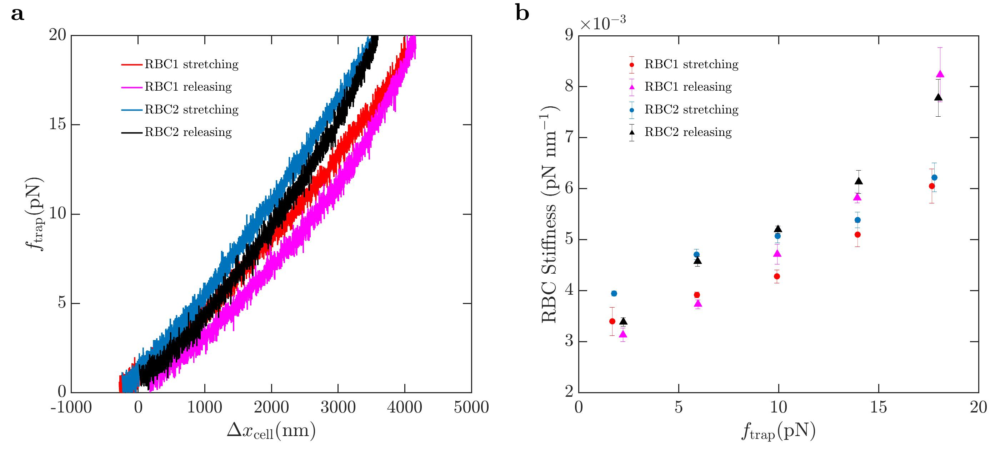

# Section 4.2: Single cell mechanics
 This folder contains the codes to analize the experiments of  a single molecule pulling experiment discussed in the text.
 
How to use the Single  cell mechanics section:

**Force extension and stiffness**

Run [CelullarMechanics.m](programs/CelullarMechanics.m) in  folder [programs](programs/) to obtain separated trajectories and stiffness of the cell from pulling protocol. Given a txt file, the program asks to select the number of columns of the file, the columns of Y force, trap A Y distance, trap B Y distance, value of trap stiffness, maximum force, minimum force and number of stiffness intervals,it returns the separated trajectories in diferent files named 'filename_#trajectoryT_U.txt'(ex:RBC1_1T_U.txt') if we are going from low forces to high forces and 'filename_#trajectoryT_D.txt'(ex:RBC1_1T_D.txt') if we are going from high forces to low forces. In these files the first column will be celullar extension and the second column will be Y force. All the trajectories will be forced to start to (0,0) in order to correct any drift. The second file named 'filename_Stiffness.txt' (ex: RBC1_Stiffness.txt) where first column will correspond to the mean Y force and the second one to the Stiffness value.

[CelullarMechanics.m](programs/CelullarMechanics.m)  will display an explorer window will open for you to select the file to analyze, go to folder [data](data/) and select [RBC1.txt](data/RBC1.txt) and  [RBC2.txt](data/RBC1.txt), one at a time. After selecting the data file enter the following parameters:

Number of columns: 16

Y force: 5

YA dist: 12

YB dist: 14

Trap stiffness value in pN/nm : 0.06

MaxForce: 20

MinForce:0

Intervals of Stiffness:6

This analysis will create a set of **txt** files in folder [results](results/) that program [force_extension_stiffnes_Fig19.m](programs/force_extension_stiffness_Fig19.m) will use to obtain the plot of the previous, plotting stiffness respect to force. This  also useful if you want to use another program for plotting.

***

 
This repository includes the analysis and plot codes for the the article **Optical Tweezers: A comprehensive Tutorial  from Calibration to Applications** by *[Jan Gieseler](https://scholar.google.com.ar/citations?user=6OKJlNgAAAAJ&hl=en), [Juan Ruben Gomez-Solano](https://www.fisica.unam.mx/es/personal.php?id=639), [Alessandro Magazù](http://softmatterlab.org/people/alessandro-magazzu/),  [Isaac Pérez Castillo](https://scholar.google.com.mx/citations?user=58GAc80AAAAJ&hl=en), [Laura Pérez García](http://softmatterlab.org/people/laura-perez-garcia/), [Martha Gironella-Torrent](https://scholar.google.com/citations?user=tITfJqkAAAAJ&hl=en), [Xavier Viader-Godoy](https://scholar.google.com/citations?user=dTLMJy0AAAAJ&hl=en), [Felix Ritort](http://ffn.ub.es/ritort/), [Giuseppe Pesce](https://scholar.google.com/citations?user=Sf4mmT8AAAAJ&hl=en), [Alejandro V. Arzola](https://orcid.org/0000-0002-4860-6330), [Karen Volke-Sepulveda](https://www.fisica.unam.mx/es/personal.php?id=27) and [Giovanni Volpe](http://softmatterlab.org/people/giovanni-volpe/)*.
