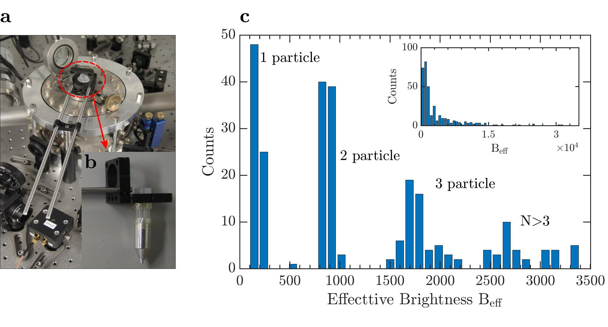
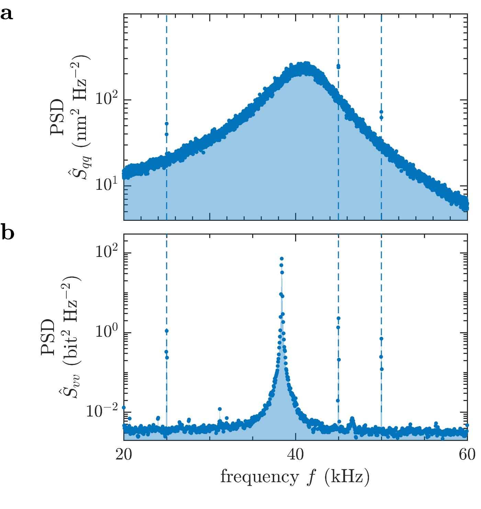
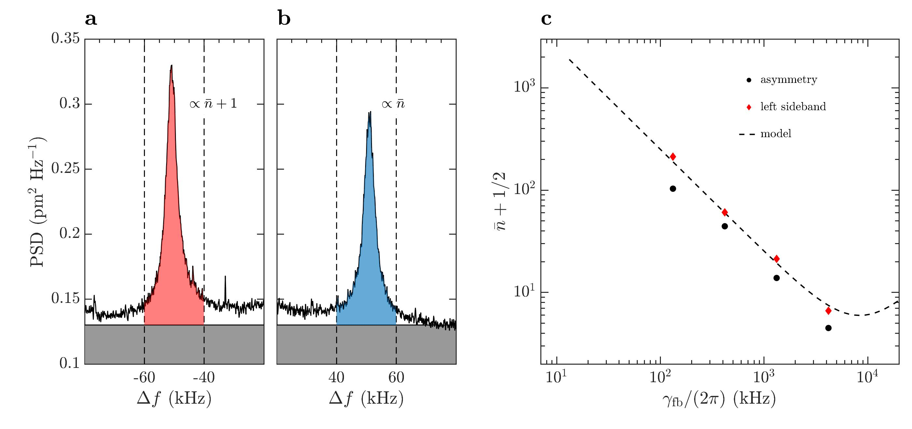
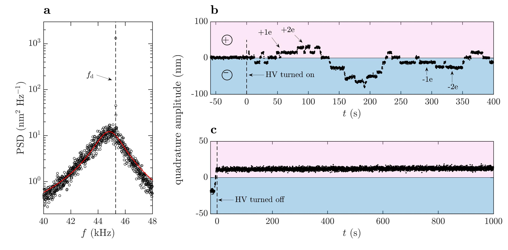
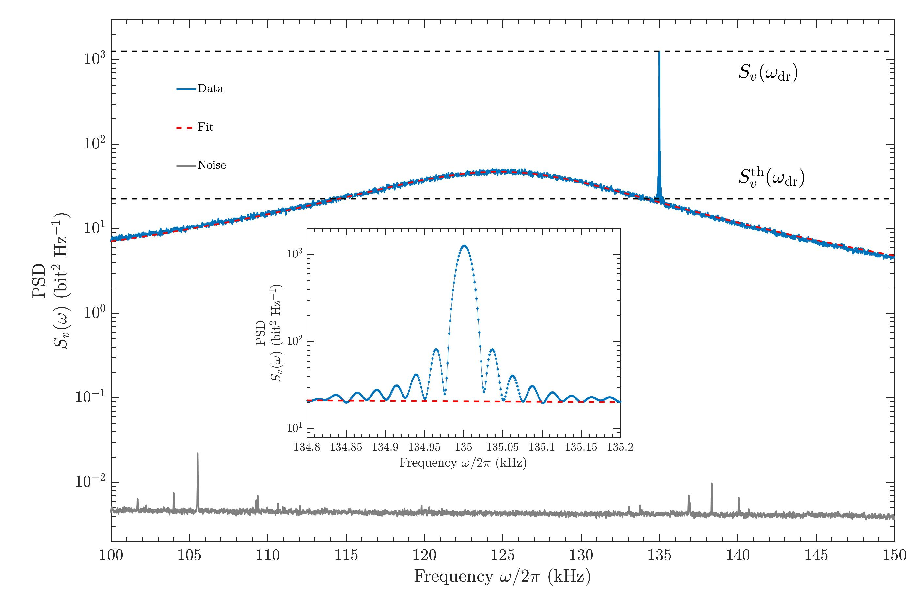
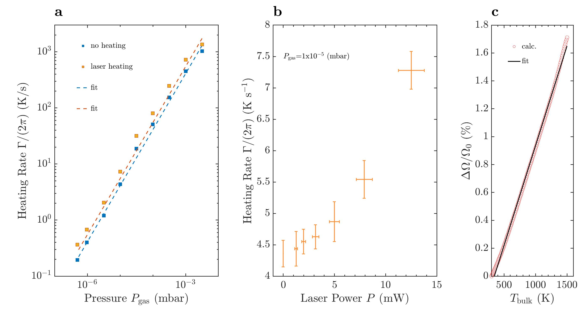
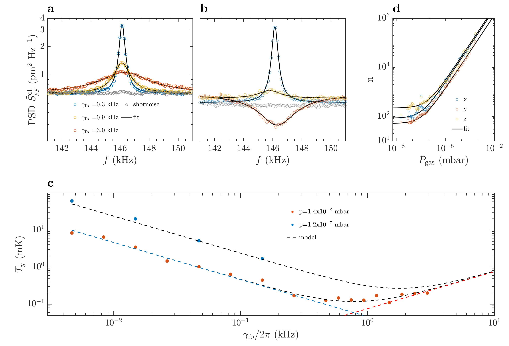

# Section 5 Optical tweezers in vacuum

This folder contains the codes to analyze the data obtained from the experiments with optical tweezers in vacuum.

**From overdamped to underdamped**

Run [overdamped_to_uderdamped_Fig35.m](overdamped_to_underdamped/programs/overdamped_to_uderdamped_Fig35.m)
We plot the measured PSD for the z-axis
motion, normalized to the damping rate 
γ_0/(2π), at three different pressures for a levitated
particle (radius a = 68 nm, laser power P≋150mW) that is overdamped (blue line),
critically damped (orange line), and underdamped (green line). The dashed black lines are
least-square fits to equation (164) (1000 mbar) or equation (163) (60 and 2.5 mbar). The
colored vertical solid lines indicate the roll-off frequencies 
Ω_c/2π. For the time traces at
60 and 2.5 mbar, the spectra contain leakage signals from the other oscillation axes above
100 kHz. Data from E. Hebestreit, “Thermal properties of levitated nanoparticles,” Ph.D. thesis, ETH Zurich (2017).

**Gas composition**

Run [composition_gas_Fig39.m](gas_composition/programs/composition_gas_Fig39.m) Gas composition in a vacuum chamber. Gas composition in the vacuum chamber
at pressures below 10^3 mbar plotted over time. The solid lines show the partial pressures of
different gas species measured with a residual gas analyzer (RGA). The sum of all the partial
pressures yields the total pressure at the RGA (dashed line). Due to the configuration of the
vacuum system and the reduced pumping speed at the RGA, the pressure at the RGA deviates
from the pressure in the main vacuum chamber (dash-dot line). The initial rise in partial
pressures after turning on the RGA is attributed to the warm-up process and desorption of
gases from the filament of the RGA. Reproduced from Ref. [467].

***
 
 
 **Particle loading**
 
Run [particle_loading_Fig40.m](particle_loading/programs/particle_loading_Fig40.m) Particle loading with a nebulizer. The particle is loaded by spraying a solution
of nanoparticles through a nozzle which is placed above the focus. (a) Positioning of the
nozzle in the vacuum chamber. (b) Nozzle to funnel the falling particles towards the focus
of the trapping laser. (c) Histogram of brightness observed with a camera from the side.
The inset shows the brightness over a wider range. Reproduced from J. Gieseler, “Dynamics of optically levitated nanoparticles in high vacuum,” Ph.D. thesis, Universitat Politècnica de
Catalunya (2014). (a,b) and
adapted from F. Ricci, “Levitodynamics toward force nano-sensors in vacuum,” Ph.D. thesis, Universitat Politècnica de Catalunya
(2019).

**Detector calibration**

Run [detector_calibration_Fig42.m)](detector_calibration/programs/detector_calibration_Fig42.m) to obtain Sideband thermometry. (a-b) Motional sideband asymmetry measured with
heterodyne measurement. The frequency difference  f is measured relative to the (absolute)
local oscillator shift of 1MHz. The grey solid lines show the measurement noise floor,
limited by technical laser noise. The vertical dashed lines indicate the integration bandwidth
(see equation 188). (c) Mean occupation number as a function of feedback gain. The red
diamonds are obtained by integrating the red sideband of the heterodyne spectrum. The
black circles show the mean occupation number extracted according to equation (189). The
black solid line corresponds to a parameter-free model (see also section 5.7.1). Figures
adapted from F. Tebbenjohanns, M. Frimmer, V. Jain, D.Windey, and L. Novotny, “Motional sideband asymmetry of a nanoparticle
optically levitated in free space,” arXiv preprint arXiv:1908.05079 (2019).].

**Sideband thermometry**

Run [sideband_thermometry_Fig43.m](sideband_thermometry/programs/sideband_thermometry_Fig42.m) (a-b) Motional sideband asymmetry measured with
heterodyne measurement. The frequency difference  f is measured relative to the (absolute)
local oscillator shift of 1MHz. The grey solid lines show the measurement noise floor,
limited by technical laser noise. The vertical dashed lines indicate the integration bandwidth
(see equation 188). (c) Mean occupation number as a function of feedback gain. The red
diamonds are obtained by integrating the red sideband of the heterodyne spectrum. The
black circles show the mean occupation number extracted according to equation (189). The
black solid line corresponds to a parameter-free model (see also section 5.7.1). Figures
adapted from F. Tebbenjohanns, M. Frimmer, V. Jain, D.Windey, and L. Novotny, “Motional sideband asymmetry of a nanoparticle
optically levitated in free space,” arXiv preprint arXiv:1908.05079 (2019).

**Charge calibration**

Run [charge_calibration_Fig44.m](charge_calibration/programs/charge_calibration_Fig44.m) to obtain (a) Power spectral density of the motion along the optical
axis of a charge-carrying particle at a pressure of 1:9 mbar in the presence of a drive tone
fd = w_d/2π applied to the capacitor. The solid line is a Lorentzian function fit to the
data. (b) Quadrature component of particle oscillation in response to a driving voltage,
demodulated in a bandwidth of 7 Hz. The high-voltage discharge is turned on at t = 0. The
oscillation amplitude changes in discrete steps while the high voltage is on. (c) Preparation
of charge state. The high voltage is turned off at t = 0, while the particle carries a net charge
of 1e. The charge stays constant over the remainder of the measurement. Figure adapted
from M. Frimmer, K. Luszcz, S. Ferreiro, V. Jain, E. Hebestreit, and L. Novotny, “Controlling the net charge on a
nanoparticle optically levitated in vacuum,” Phys. Rev. A 95, 061801 (2017).

**Mass calibration**

Run [mass_calibration_Fig45.m](mass_calibration/programs/mass_calibration_Fig45.m) Power spectral density Sv(w) of a thermally and harmonically
driven resonator at P = 50 mbar. The broad peak centered at 
Ω_0/2π = 125 kHz corresponds
to the thermally driven state. We fit it with a Lorentzian function (orange) to extract S^th
_vv (ω_d)
together with G/(2π) = 31.8 kHz and the corresponding uncertainties. The narrowband
peak at ! = 135 kHz, also shown in detail in the inset, depicts the electrical excitation from
which we retrieve S^th
_vv (ω_d). Gray data points at the bottom of the plot is the measurement
which we retrieve Sd
noise, which is ∼ 40 dB below the particle’s signal. Figure adapted fromF. Ricci, “Levitodynamics toward force nano-sensors in vacuum,” Ph.D. thesis, Universitat Politècnica de Catalunya (2019).

**Particle heating**

Run [particle_heating_fig_46.m](particle_heating/programs/particle_heating_fig_46.m)(a) Heating rates as a function of pressure extracted from
relaxation measurements without additional heating of the internal temperature (blue) and
with heating by a CO2 laser intensity of 0:47 Wm􀀀2 (orange). The dashed lines are linear
fits to the data points. Error bars are smaller than the marker size. (b) Heating rates at
different intensities of the CO2 laser measured at a pressure of 1  10􀀀5 mbar. The error bars
indicate the standard deviation of the measurements. (c) Calculated temperature dependence
of oscillation frequency. When the particle is heated with the CO2 laser, its oscillation
frequency increases due to changes in the particle’s material properties. This leads to a
nearly linear relation between relative frequency change and increase of the internal particle
temperature. Adapted from E. Hebestreit, R. Reimann, M. Frimmer, and L. Novotny, “Measuring the internal temperature of a levitated nanoparticle in high vacuum,” Phys. Rev. A 97, 043803 (2018).

**Feedback cooling**

Run [feedback_cooling_Fig47.m](feedback_cooling/programs/feedback_cooling_Fig47.m) (a) Single-sided power spectral densities S^ol_
yy of the motion
of the nanoparticle measured by the out-of-loop detector for different feedback damping
rates 
fb. The solid lines are Lorentzian fits to the data. The black data points denote the
measured shotnoise level on the out-of-loop detector. (b) Mode temperature Ty derived
from the out-of-loop signal as a function of feedback gain 
fb. The black circles denote
the measured values at a pressure of 1.4 x10^-8 mbar. Photon shot noise is shown as black
data points. In contrast to (a), for a large feedback gain the measured signal drops below
the noise floor. (c) Power spectral densities measured by the in-loop detector for the same
settings as in (a). (d) Steady state under parametric PLL feedback cooling. Mean occupation
number along the three principal axes (x; y; z) as a function of gas pressure measured under
constant feedback cooling. At low enough pressures, photon recoil becomes the main source
of heating and therefore the occupation number remains constant. Adapted from F. Tebbenjohanns, M. Frimmer, A. Militaru, V. Jain, and L. Novotny, “Cold damping of an optically levitated
nanoparticle to microkelvin temperatures,” Phys. Rev. Lett. 122, 223601 (2019).
(a-b) and from V. Jain, J. Gieseler, C. Moritz, C. Dellago, R. Quidant, and L. Novotny, “Direct measurement of photon recoil from
a levitated nanoparticle,” Phys. Rev. Lett. 116, 243601 (2016).

This repository includes the analysis and plot codes for the the article **Optical Tweezers: A comprehensive Tutorial  from Calibration to Applications** by *[Jan Gieseler](https://scholar.google.com.ar/citations?user=6OKJlNgAAAAJ&hl=en), [Juan Ruben Gomez-Solano](https://www.fisica.unam.mx/es/personal.php?id=639), [Alessandro Magazù](http://softmatterlab.org/people/alessandro-magazzu/),  [Isaac Pérez Castillo](https://scholar.google.com.mx/citations?user=58GAc80AAAAJ&hl=en), [Laura Pérez García](http://softmatterlab.org/people/laura-perez-garcia/), [Martha Gironella-Torrent](https://scholar.google.com/citations?user=tITfJqkAAAAJ&hl=en), [Xavier Viader-Godoy](https://scholar.google.com/citations?user=dTLMJy0AAAAJ&hl=en), [Felix Ritort](http://ffn.ub.es/ritort/), [Giuseppe Pesce](https://scholar.google.com/citations?user=Sf4mmT8AAAAJ&hl=en), [Alejandro V. Arzola](https://orcid.org/0000-0002-4860-6330), [Karen Volke-Sepulveda](https://www.fisica.unam.mx/es/personal.php?id=27) and [Giovanni Volpe](http://softmatterlab.org/people/giovanni-volpe/)*.
